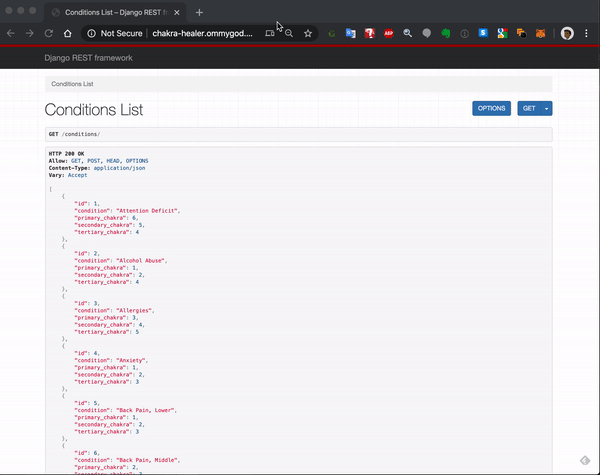

# Chakra Healer Django Rest Framework Hosted on AWS

Deployed URLs:
+ http://chakra-healer.ommygod.com:8000/chakras
+ http://chakra-healer.ommygod.com:8000/conditions
+ http://chakra-healer.ommygod.com:8000/users

## AWS Hosting Instructions:
```
EC2 Configuration
1. Create security groups:
    1. Default VPC
        1. Django Admin
            1. ssh port 22 0.0.0.0/0
            2. Web port 80 0.0.0.0/0
            3. TLS port 443 0.0.0.0/0
            4. Django port 8000 0.0.0.0/0
    2. Create ssh key to be used during install:
        1. Name django-ssh
    3. Launch EC2 Instance
        1. Ubuntu Pipenv - ami-0fa3ffa87842eb4a9
    4. Choose defaults
    5. Choose newly created SSH key
    6. When instance running get IP address
    
Ubuntu Instance configuration
    1. ssh -i  /path/to/ssh-key ubuntu@[IP address from above]
    2. Once logged in type the following commands:
        1. Sudo apt-get install postgresql
        2. sudo -u postgres -i
        3. createdb [your db name from your project settings]
        4. psql 
            1. CREATE USER ON DATABASE [from project settings]
            2. GRANT PRIVILEGES
            3. exit
        5. exit
        6. Git clone [your project repo for django]
        7. Cd into project directory
        8. Nano settings.py
            1. Change line 
            ALLOWED HOSTS [
                      '*'
            ]
        1. Pipenv shell
            1. Python manage.py makemigrations
            2. Python manage.py migrate
            3. Python manage.py runserver 0.0.0.0:8000
        2. Screen
            1. Use screen to run terminal in the background in ubuntu instance
            2. screen -S django
            3. pipenv shell
            4. python runserver 0.0.0.0:8000
            5. CTRL-a-d
            6. Exit
        3. Now you are returned to the ubuntu ssh prompt.
        4. Exit ssh.
        5. NOTE:  Server still running in background
        6. To reconnect:
            1. sh -i  /path/to/ssh-key ubuntu@[IP address from above]
            2. screen -r django
            3. NOTE you are now in django screen session where django running in background.
            4. Can kill using CTRL-C
            5. Or exit back to the initial prompt.
Go to:
http://x.x.x.x:8000
Where x.x.x.x = IP address from EC2 Above
```

Uses AWS EC2

It seeds data using This application uses React to pull data from an API the developer designed and pushed to Heroku and MongoAtlas




